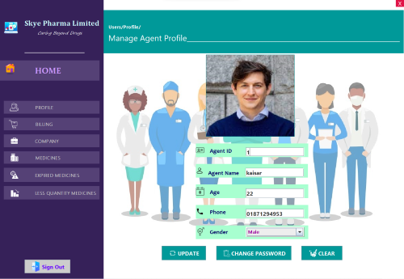
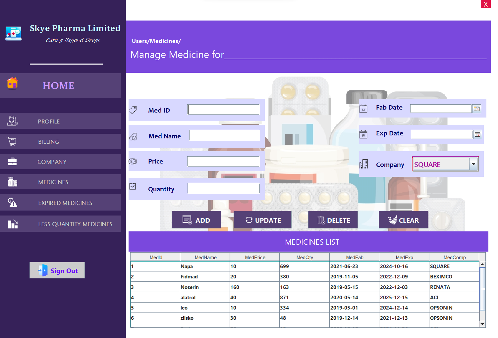
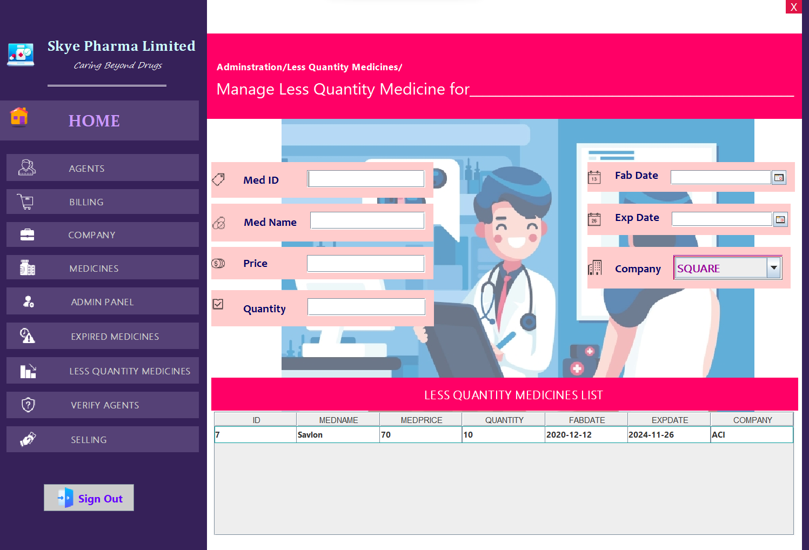
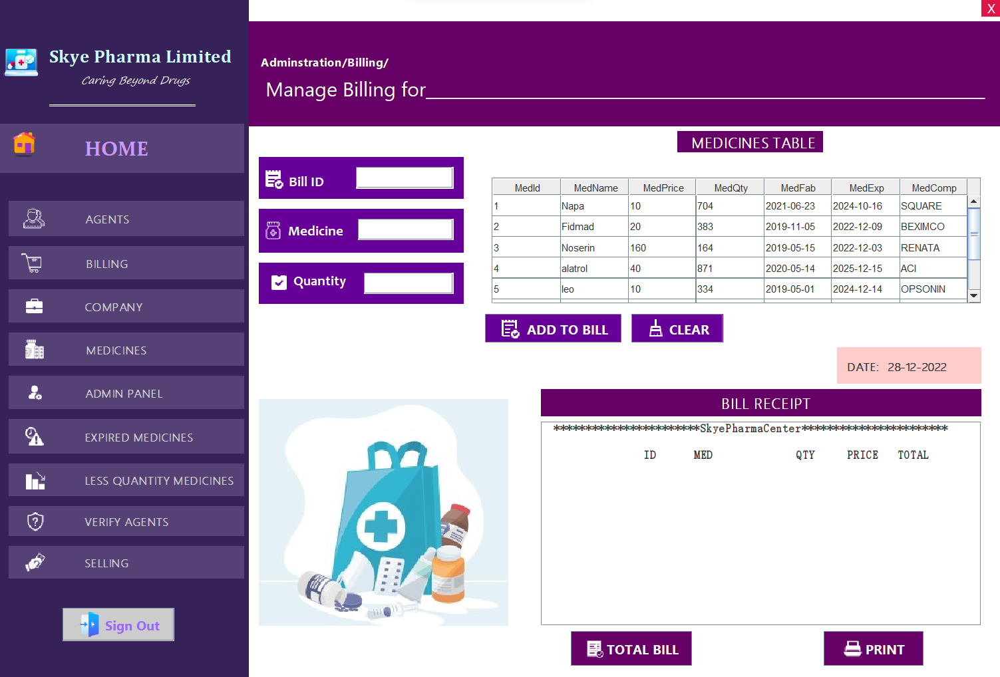
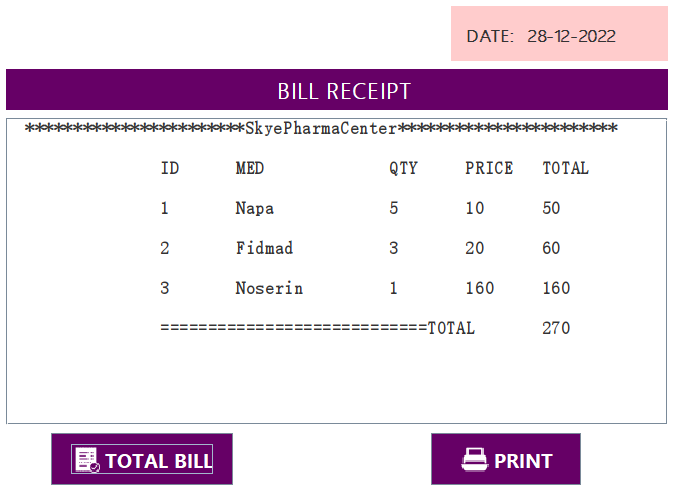
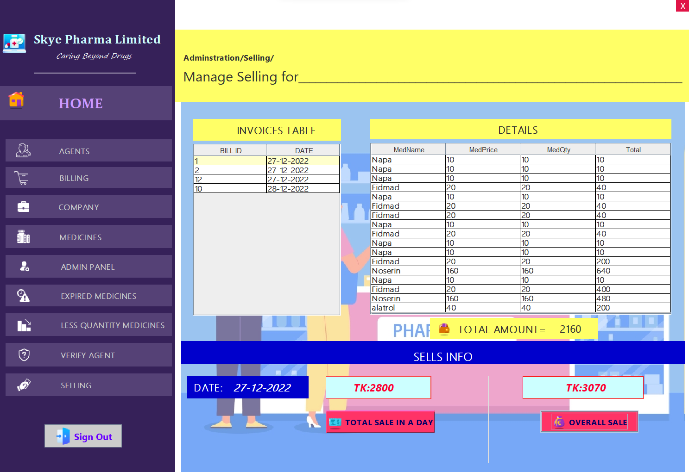

# Skye Pharma Limited - A Complete Pharmacy Management System

Welcome to the **Skye Pharma Limited Pharmacy Management System**! This desktop application is designed to streamline pharmacy operations by managing inventory, transactions, and overall business efficiency.

## Objectives

- **Inventory Tracking**: Monitor all medicines in the pharmacy.
- **Stock Management**: Oversee and manage medicine stock levels.
- **Error Reduction**: Minimize billing and transaction errors.
- **Expiration Alerts**: Keep track of expired and low-stock medicines.

## Features

### For Admin
- **Agent Management**: Add, update, and remove agents.
- **Medicine Management**: Manage medicine details, including additions, updates, and deletions.
- **Company Management**: Maintain company information.
- **Billing System**: Handle transactions efficiently.
- **Transaction Tracking**: Monitor daily and overall sales.

### For Agents
- **Medicine and Company Management**: Manage details relevant to their tasks.
- **Billing Operations**: Process transactions accurately.
- **Inventory Alerts**: Receive notifications for expired and low-stock medicines.

## Application Design

Our user-friendly interface is designed to facilitate ease of use for both administrators and agents.

### Screenshots

#### Login and Sign Up

#### Agent Management

1. **Welcome page for Agent**

2. **Agent Profile**

3. **Agent Management**

   

#### Company Management

#### Medicine Management

1. **Medicines Management**

2. **Expired Medicine Management**

3. **Less Quantity Medicine Management**

#### Billing System

1. **Billing Procedure**

2. **Bill Receipt**

#### Sales Tracking

## Security Features
- **Password Recovery**: Secure forget password feature with security questions.
- **Database Connectivity**: Ensures secure and reliable data management.

## Applications

This application is ideal for pharmacies looking to digitalize their operations. It helps reduce manpower, is easy to use, and offers robust security features, making it a comprehensive solution for pharmacy management.

---
